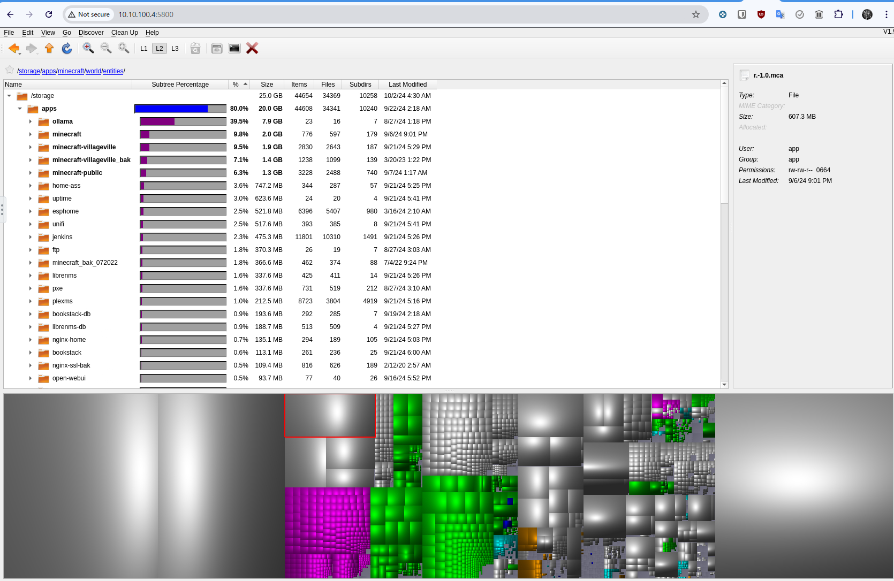

# NFS Backend Storage

This document describes how to set up an NFS backend storage for the Kubernetes cluster.

## Prerequisites

- A separate machine with NFS server installed or maybe a NAS device that supports NFS.
- The NFS server should be accessible from the Kubernetes cluster.
- The NFS server should have a shared directory that will be used as the backend storage for the cluster.
- The NFS server should have a static IP address or a domain name that can be used to access it.
- The NFS server should have the necessary permissions set up to allow the Kubernetes cluster to read and write to the shared directory.

## My Setup

- I have a Raspberry Pi running Ubuntu Server with an NFS server installed.
- There is an 8 TB USB hard drive connected to the Raspberry Pi that is shared via NFS.
- The Raspberry Pi has a static IP address on my local network.
- The shared directory on the Raspberry Pi is `/nfsshare`.
- Not an ideal for storage but it works, for now...
 

## Setup NFS Server

- Not going to go into the details of setting up a connecting a USB hard drive to a Raspberry Pi and formatting and mounting it.  ChatGPT time!
- Something to keep in mind is that your Raspberry Pi and/or the HDD might want to go to sleep after a while.  You might want to disable that so that the NFS server is always available.
  - Two ways to do this ( I do both ):
    - Disable the sleep mode on the Raspberry Pi.
      - Modify the `/boot/firmware/cmdline.txt` and add ` usbcore.autosuspend=-1` to the end of the line.
      - Mine looks like this ( For reference, don't copy this, yours will be different ) take note of the `usbcore.autosuspend=-1` at the end:
        ```
        console=serial0,115200 console=tty1 root=PARTUUID=13cb3698-02 rootfstype=ext4 fsck.repair=yes rootwait usbcore.autosuspend=-1
        ```
    - Use `hdparm` to disable the sleep mode on the HDD. /dev/sda is the device name of the HDD in my setup.  You can find the device name by running `lsblk`.
      - `sudo hdparm -S 0 /dev/sda`
- In my example I'm choosing to share the `/nfsshare` directory on the Raspberry Pi for the NFS server.
- Install the NFS server on the Raspberry Pi ( this should already be installed with the Packer template we made in the previous section ):
  - `sudo apt update`
  - `sudo apt install nfs-kernel-server`
- Update the `/etc/exports` file to allow the Kubernetes cluster to access the shared directory.
  - Add the following line to the end of the file:
    ```
    /nfsshare *(rw,sync,no_subtree_check,no_root_squash)
    ```
  - This line allows any IP address to access the `/nfsshare` directory with read and write permissions.
  - You can restrict the access to specific IP addresses if you want by replacing `*` with the IP address or subnet.
- Use the following command to export the shared directory:
  - `sudo exportfs -a`
  - This command exports all the directories listed in the `/etc/exports` file.
- Restart the NFS server to apply the changes:
  - `sudo systemctl restart nfs-kernel-server`

## Test NFS Server from a k8s node

- SSH into one of the k8s nodes.
- Create a temp directory to test the NFS mount:
  - `mkdir /tmp/nfsmount`
- Mount the NFS shared directory to the temp directory:
  - `sudo mount -t nfs <nfs-server-ip>:/nfsshare /tmp/nfsmount`
  - Replace `<nfs-server-ip>` with the IP address of your NFS server.
- Check if the mount was successful:
  - `df -h /tmp/nfsmount`
- Create a test file in the NFS shared directory:
  - `echo "Hello from NFS" > /tmp/nfsmount/test.txt`
- Check if the file was created in the NFS shared directory:
  - `ls /tmp/nfsmount`
- Unmount the NFS shared directory:
  - `sudo umount /tmp/nfsmount`
  
## Creating a deployment that uses the NFS backend storage

- We'll be deploying a pod thats running `qdirstat`, a web based disk usage analyzer.
- We'll be deploying two PVs and PVCs that use the NFS backend storage.
  - One PV and PVC will be used for the `qdirstat` pod configuration files.
  - The other PV and PVC will be used to scan the disk usage of the NFS shared directory in read-only mode.
- The pod will be accessible via a LoadBalancer service.  In this example we're not going through the whole process of setting up gateways and tunnels, this time.  Feel free to do that on your own.

- There are a few ways to use the NFS storage for your pod backends
  - You can use a Storage Class to dynamically provision Persistent Volumes that use the NFS backend storage.
  - Use and external NFS provisioner. https://github.com/kubernetes-sigs/nfs-subdir-external-provisioner
  - OR you can manually create Persistent Volumes that use the NFS backend storage and then use those Persistent Volumes in your deployments.
  - The last option is most primitive and is what I'm going to show you here.

- Since we're going with the last option, we need to first go into the NFS server and create a folder in the shared directory that we can use for this deployment.
  - SSH into the NFS server.
  - `sudo mkdir /nfsshare/apps1/dir`
  - `sudo chmod 777 /nfsshare/apps1/dir`

- I've included 3 files in the files folder of this directory
- `nfs-pv.yaml`: This file defines a Persistent Volume that uses the NFS backend storage.
- `nfs-pvc.yaml`: This file defines a Persistent Volume Claim that requests storage from the Persistent Volume.
- `nfs-deployment.yaml`: This file defines a Deployment that uses the Persistent Volume Claim.

- Update the `nfs-pv.yaml` file with the IP address of your NFS server and the path to the shared directory for BOTH resources defined in that file

- Deploy all the files in the files folder:
  - `kubectl apply -f files/`
- Check your PV and PVC resources to make sure they are bound:
  - `kubectl get pv`
  - `kubectl get pvc`
  ```
  packer@k8s-m1:~$ kubectl get pv
  NAME             CAPACITY   ACCESS MODES   RECLAIM POLICY   STATUS   CLAIM                    STORAGECLASS   VOLUMEATTRIBUTESCLASS   REASON   AGE
  nfs-dir          2000Gi     RWX            Retain           Bound    default/nfs-dir                         <unset>                          6m20s
  nfs-dir-ro-dir   2000Gi     RWX            Retain           Bound    default/nfs-dir-ro-dir                  <unset>                          6m20s
  packer@k8s-m1:~$ kubectl get pvc
  NAME             STATUS   VOLUME           CAPACITY   ACCESS MODES   STORAGECLASS   VOLUMEATTRIBUTESCLASS   AGE
  nfs-dir          Bound    nfs-dir          2000Gi     RWX                           <unset>                 6m19s
  nfs-dir-ro-dir   Bound    nfs-dir-ro-dir   2000Gi     RWX                           <unset>                 6m19s
  ```
- Check the `EXTERNAL-IP` of the `service-dir` service:
  - `kubectl get svc`
  ```
  packer@k8s-m1:~$ kubectl get service | grep dir
  service-dir                      LoadBalancer   10.101.179.130   10.10.100.4   5800:32026/TCP               6m6s
  ```
- Open your browser and navigate to `http://<EXTERNAL-IP>:5800` to access the `qdirstat` pod.
- In my case, the URL will be `http://10.10.100.4:5800`

