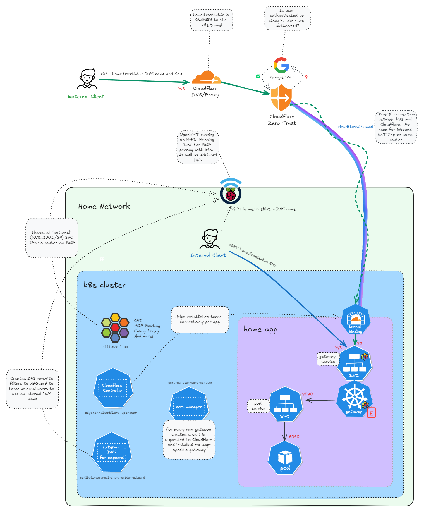
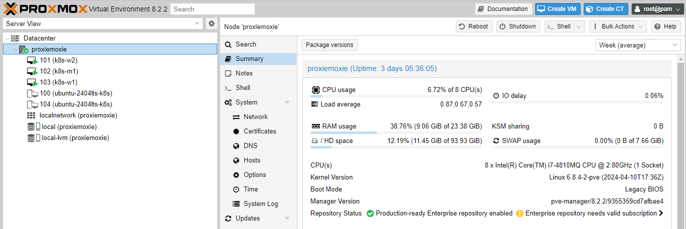

# WORK IN PROGRESS!

I hope you like my repo name.  Shoutout to Github Co-Pilot for the assist on these docs.  And I blame Github Co-Pilot for any errors in the docs.  I could never.

If you see any issues with the documentation, please create an issue or a pull request.  I'm always looking to improve my documentation and code.  I'm also open to suggestions on how to improve the documentation and code.  I'm always looking to learn new things and new ways to do things.

Disclaimer: This is not a production ready setup.  This is a homelab setup.  I'm not responsible for any issues or trauma that arise from using this setup in a production environment.  Use at your own risk.

# Homelab K8S Cluster with Cilium and Cloudflare

Create your own Kubernetes cluster with Cilium and Cloudflare.  

Intentions of this project are to not only share my code of my existing homelab but also to provide a guide on how to setup your own Kubernetes cluster with Cilium and Cloudflare.  This project is a culmination of my learnings from various sources and my own experiences.  I hope that this project will help others in their journey to learn Kubernetes and networking.

- Cilium for service mesh, envoy proxying, and network observability.
- Cloudflare for DNS and Zero Trust Access.
- Cert-Manager for Let's Encrypt publicly signed certificates.
- ExternalDNS for automatic DNS record creation on AdGuard Home DNS service.

## Minium Requirements

The bare minimum requirements to run the core services and not any other applications.

Between all 3 nodes:
- 10 GBs - and that's really THE minimum.  You will need more if you plan to run applications on the cluster.
- Any proc if you going to let it idle.  CPU requirements really depend on what you are going to run on the cluster after setup.
- 20 GBs of disk space.  This is the minimum for the OS and the core services.  You will need more if you plan to run applications on the cluster.

Example usage of how much core services will use:

## This Examples Hardware Configuration

- 1x Raspberry Pi 4 8GB
  - OpenWrt Router
  - AdGuard Home DNS
  - bird BGP routing
- 1x Dell m4800 Laptop - 24 GBs of RAM - 1TB SSD
  - Proxmox hypervisor
    - 1 x k8s master VM and 2x k8s worker VMs
      - Cilium
      - ExternalDNS
      - Cert-Manager
      - Cloudflare tunnel operator

## Setup Instructions

- [Dependencies](0-dependencies/)
  - A small list of manual, very general steps to get the environment ready for the automation.
- [Packer](1-packer/README.md)
  - Create a Proxmox VM Ubuntu template by pulling an Ubuntu image from the internet and installing the necessary software.
- [Terraform](2-terraform/README.md)
  - Use the packer template to create 3 VMs on Proxmox.
- [Kubernetes and Cilium](3-k8s-setup/README.md)
  - Setup Kubernetes and Cilium on the Proxmox VMs.
- [Cloudflare Zero Trust](4-zero-trust/README.md)
  - Using terraform to setup Cloudflare Zero Trust Access.
- [My First App](5-my-first-app/README.md)
  - Deploying and troubleshooting a simple app on the cluster.
- [Extracurricular](6-extracurricular/README.md)
  - For funsies, some extra stuff to do with the cluster.

# Who am I?

I'm a Cloud Engineer by day and a Kubernetes admin by night.  